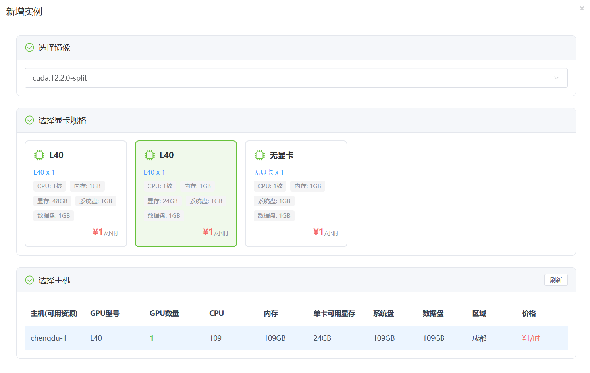
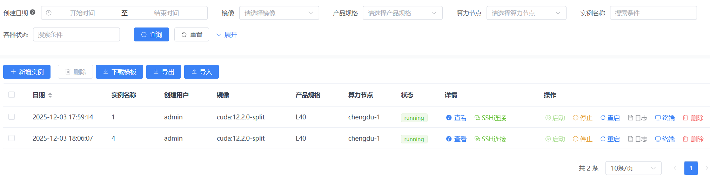
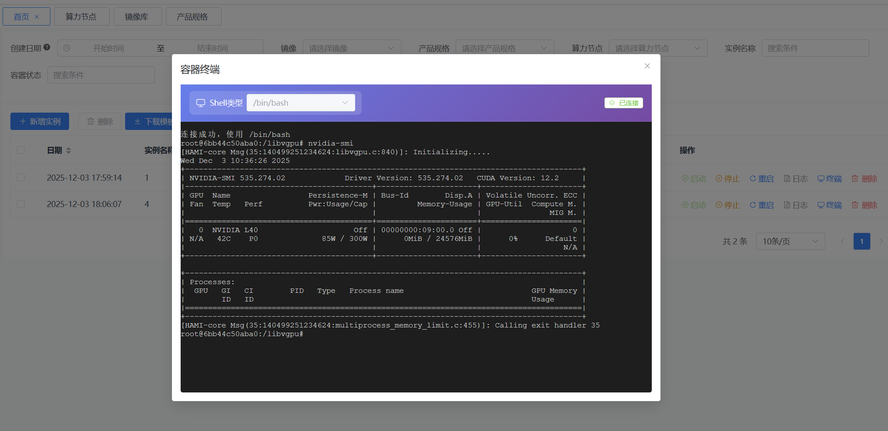
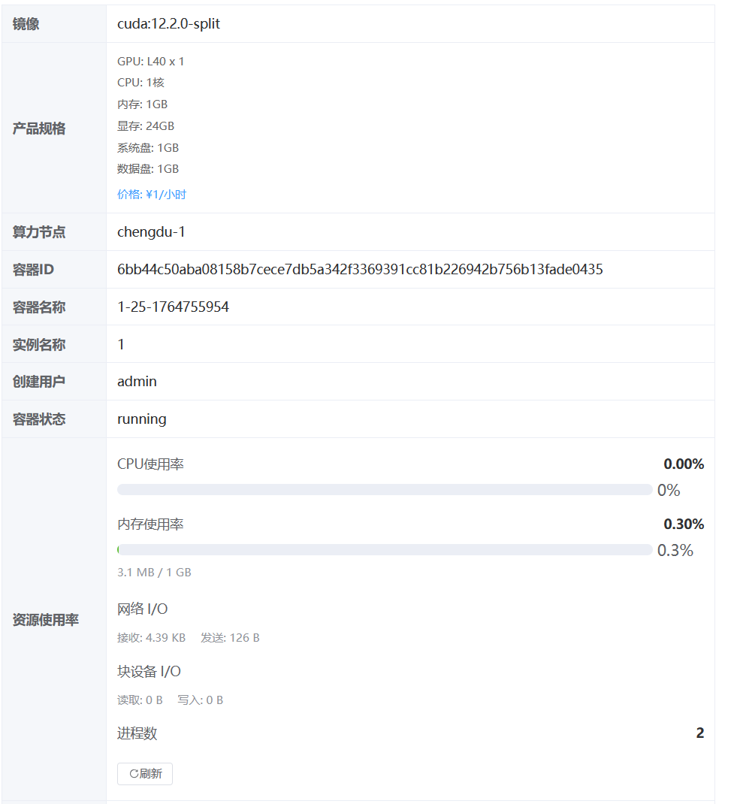

[简体中文](README.md) | [English](README.en.md)

# TianQi GPU Manager (天启算力管理平台)

**Docker GPU Compute Management Platform** — an enterprise-grade GPU containerized resource management and scheduling system that helps organizations manage and allocate GPU compute resources efficiently and securely.


## 📖 Introduction

TianQi GPU Manager is a front-end/back-end separated, enterprise-grade GPU compute management platform, built on top of the [gin-vue-admin](https://github.com/flipped-aurora/gin-vue-admin) scaffold. It brings scattered GPU servers under unified management as compute nodes, automatically creates GPU container instances by combining "image registry + product spec + compute node", and provides full lifecycle management from creation, connection and monitoring to teardown.

As AI/deep learning adoption grows, GPU compute has become scarce and expensive. Traditional management approaches suffer from low utilization, high multi-node administration cost, lack of access control, and manual-heavy operations. This platform addresses these pain points with unified resource scheduling, HAMi vGPU memory slicing for fine-grained allocation, multi-user isolation based on RBAC, dual access channels via SSH jump host and web terminal, plus container-level real-time monitoring and automated health checks.

The platform also ships a model training module with dataset version management and SFT/DPO/CPT training methods. Training runs on the ModelScope Swift framework, and a vLLM inference service can be started automatically once training completes — closing the loop of "compute allocation → training → inference".

It fits scenarios such as AI/ML training platforms, scientific computing platforms, in-house enterprise GPU pools, and teaching environments for educational institutions.

## ✨ Features

- 📊 **Visual dashboard**: overview of instances, product specs, compute nodes and image registries, plus recent instances
- 🖥️ **Compute node management**: unified management of multiple GPU nodes, Docker TLS secure connections, scheduled automatic checks of node Docker connectivity
- 📦 **Image registry management**: central management of multiple image sources, with flags for vGPU-slicing support and on/off shelf status
- 💰 **Product spec management**: define GPU model/count/VRAM/CPU/memory/disk and hourly pricing; supports GPU-less (GPU=0) CPU-only specs
- 🐳 **Full container instance lifecycle**: create, start, stop, restart, delete and view logs; smart node matching by spec resource requirements; automatic cleanup of mounted volumes on deletion
- 📈 **Resource monitoring**: CPU/memory usage, network I/O, block device I/O and process count, auto-refreshed every 5 seconds for running instances
- 💻 **Web terminal**: WebSocket + xterm, operate containers directly in the browser (bash/sh with adaptive terminal size)
- 🔐 **SSH jump host**: built-in SSH service (default port 2026) with system account authentication; after login users interactively pick and connect to their own containers, admins can see all
- ⚡ **HAMi VRAM slicing**: mounts HAMi-core into the container at `/libvgpu/build` and injects `LD_PRELOAD`, `CUDA_DEVICE_MEMORY_LIMIT` and `CUDA_DEVICE_SM_LIMIT` environment variables, splitting one GPU's VRAM into multiple virtual GPUs
- 🤖 **Model training**: dataset management with version control (jsonl/xls/xlsx, up to 200MB per file, batch upload auto-creates versions); SFT/DPO/CPT training methods with efficient (LoRA) and full-parameter training; training runs on the Swift framework and a vLLM inference service starts automatically afterwards
- 👥 **RBAC**: Casbin-based role access control; regular users can only operate instances they created, while admins (authorityId=888) manage everything
- ⏰ **Scheduled jobs**: a merged gcron job inspects node Docker status and container metrics every 30 seconds; database logs are cleaned daily
- 🧩 **Developer friendly**: Swagger API docs, built-in MCP Server (SSE), web-guided database initialization

## 🛠 Tech Stack

**Backend** (`server/go.mod`):

| Category | Components |
|------|------|
| Language/Framework | Go 1.23+ / Gin 1.10.0 |
| ORM/Database | GORM 1.25.12 (MySQL / PostgreSQL / SQLite / MSSQL / Oracle) |
| Auth/RBAC | golang-jwt v5.2.2 / Casbin v2.103.0 |
| Container/Terminal | Docker API v27.0.0 / gorilla/websocket 1.5.3 |
| Jobs/Logging/Config | gcron (GoFrame v2.9.5) / Zap 1.27.0 / Viper 1.19.0 |
| Cache/AI | go-redis v9.7.0 / mcp-go v0.41.1 |

**Frontend** (`web/package.json`):

| Category | Components |
|------|------|
| Framework | Vue 3.5 / Vite |
| UI/Charts | Element Plus 2.10 / ECharts 5.5 / UnoCSS 66 |
| State/Router/HTTP | Pinia 2.2 / Vue Router 4.4 / Axios 1.8 |
| Terminal | xterm 5.3 / @vueuse/core 11 |

**Deployment**: Docker, Docker Compose, Kubernetes (`deploy/kubernetes/`); the training image is based on Ubuntu 22.04 + CUDA 12.8.1 + PyTorch 2.9.0 + vLLM 0.13.0 + Swift 3.12.5.

## 🚀 Quick Start

### Requirements

- Backend: Go 1.23+, MySQL 5.7+ (or PostgreSQL/SQLite, etc.), Redis (optional)
- Frontend: Node.js 20+, npm or pnpm
- Nodes: Docker installed on every compute node (vGPU slicing additionally requires a HAMi-core image, see below)

### Option 1: Local Development

```bash
git clone https://github.com/hequan2017/tianqi.git
cd tianqi
\mv server/config.yaml.bak server/config.yaml   # initialize backend config

# Start the backend (listens on 8890 by default)
cd server
go mod download
go run main.go

# Start the frontend (listens on 8080 by default)
cd web
npm install        # or pnpm install
npm run dev        # or pnpm dev
```

Open `http://localhost:8080`. The system detects the database state automatically and redirects to the initialization page; follow the prompts and fill in the database connection info. After initialization, log in with the default admin account: `admin` / `123456` (**change the password immediately after the first login**).

Useful URLs:

- Frontend: http://localhost:8080
- Backend API: http://localhost:8890
- Swagger: http://localhost:8890/swagger/index.html

The built-in MCP Server can be attached directly in MCP-capable AI IDEs (e.g. Cursor):

```json
{
  "mcpServers": {
    "GVA Helper": {
      "url": "http://127.0.0.1:8890/sse"
    }
  }
}
```

### Option 2: One-click Docker Compose Deployment

```bash
cd deploy/docker-compose
docker-compose up -d      # start web/server/mysql/redis
docker-compose ps         # check service status
docker-compose logs -f    # view logs
```

Default ports: frontend 8080, backend 8888, MySQL 13306, Redis 16379. Once the containers are up, visit `http://localhost:8080` to finish the web-guided initialization.

### Option 3: Kubernetes Deployment

```bash
kubectl apply -f deploy/kubernetes/server/
kubectl apply -f deploy/kubernetes/web/
```

### Enabling VRAM Slicing (Optional)

1. On the Docker server, build an image following [HAMi-core](https://github.com/Project-HAMi/HAMi-core);
2. Fill the node's actual HAMi-core directory path (e.g. `/root/HAMi-core/build`) into the HAMi-core directory field of the compute node.

When creating a container with slicing enabled, the platform automatically mounts that directory to `/libvgpu/build` in the container and injects the related environment variables.

### Key Configuration (server/config.yaml)

```yaml
system:
  db-type: mysql        # database type
  addr: 8890            # backend listen port
  use-redis: false      # recommended in production

jumpbox:
  enabled: true         # enable the SSH jump host
  port: 2026            # SSH listen port

jwt:
  signing-key: your-key # change this in production
  expires-time: 7d
```

Frontend environment variables (`web/.env.development`): `VITE_BASE_API` (request prefix, default `/api`), `VITE_BASE_PATH`, `VITE_SERVER_PORT` (backend port), `VITE_CLI_PORT` (frontend port).

## 📁 Directory Structure

```
├── server/                 # Backend (Go / Gin)
│   ├── api/v1/             # API controllers (computenode/imageregistry/product/instance/modeltraining...)
│   ├── service/            # Business logic (jumpbox SSH service, modeltraining service, etc.)
│   ├── model/              # Data models
│   ├── router/             # Routes
│   ├── source/             # Seed data (menus, APIs, training module SQL)
│   └── config.yaml         # Config file (copied from config.yaml.bak)
├── web/                    # Frontend (Vue3 / Vite)
│   └── src/view/           # Pages (dashboard/instance/modeltraining, etc.)
├── deploy/                 # docker-compose / kubernetes deployment configs
└── docs/                   # Project docs and screenshots
```

## 📸 Screenshots







## 📚 Documentation

- [Development Guide](docs/DEVELOPMENT.md) — feature implementation details, call flows and architecture design
- [Quick Start](docs/Quick-Start.md) / [Features](docs/Features.md) / [Configuration](docs/Configuration.md)
- [Docker Deployment](docs/Docker-Deployment.md) / [FAQ](docs/FAQ.md) / [API Reference](docs/API-Reference.md)
- Swagger API docs: visit http://localhost:8890/swagger/index.html after starting the backend

## 🔗 Related Projects

- [gin-vue-admin](https://github.com/flipped-aurora/gin-vue-admin) — the admin scaffold this project is based on
- [HAMi-core](https://github.com/Project-HAMi/HAMi-core) — GPU VRAM slicing component used to build vGPU images

## 📄 License

This project is licensed under [EPL-2.0](LICENSE) (Eclipse Public License 2.0).
