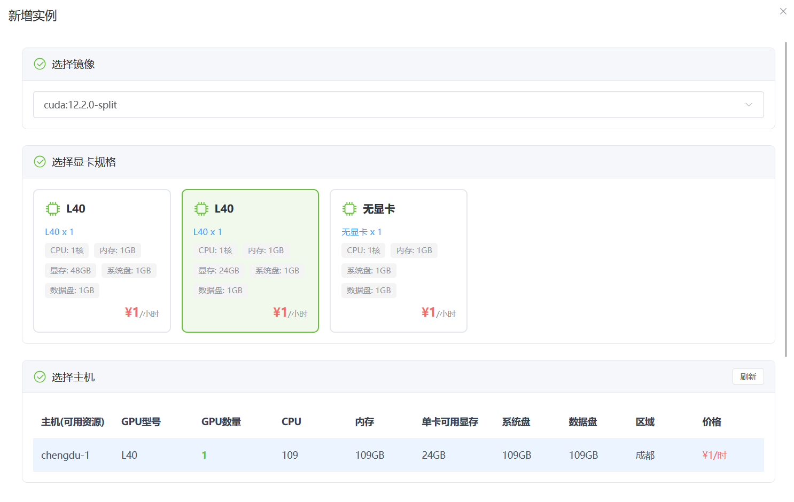
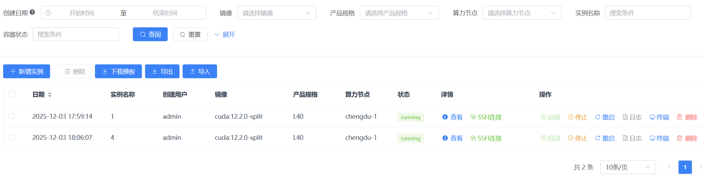
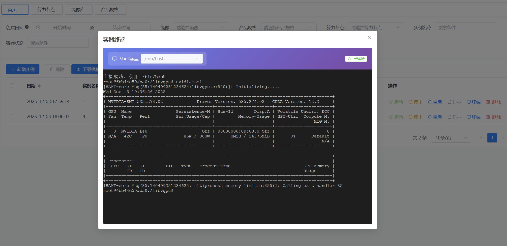
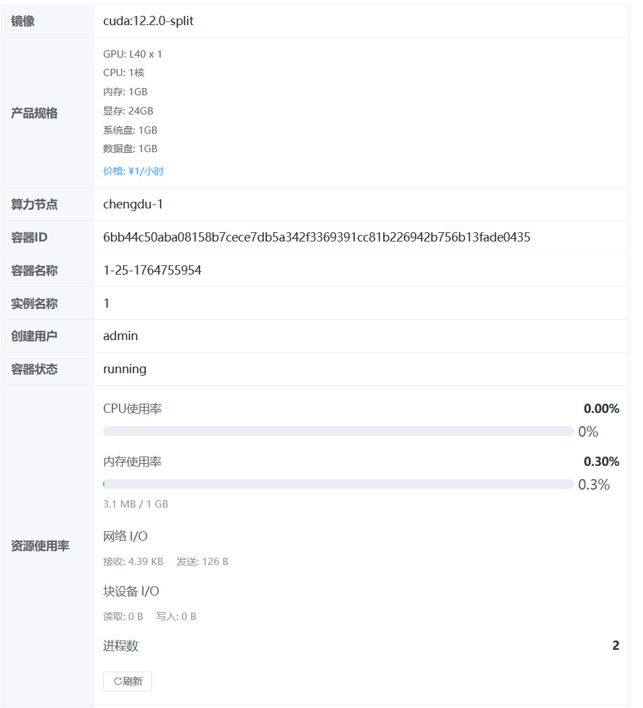
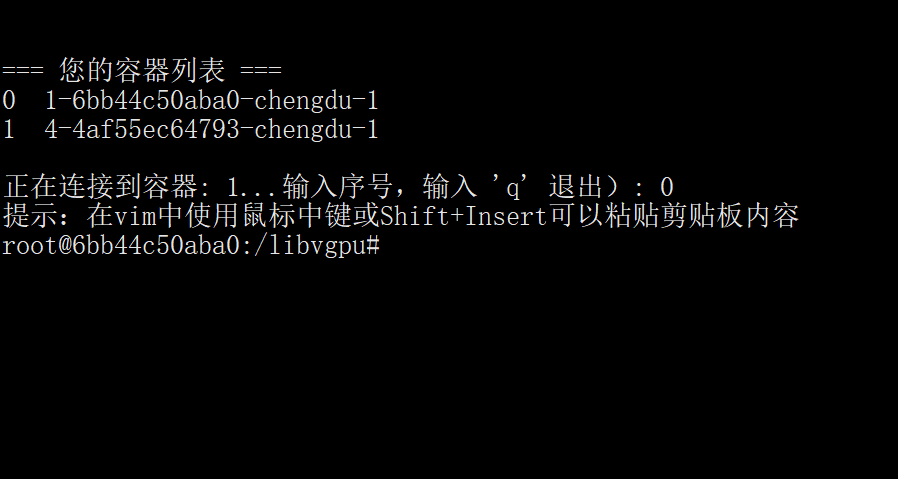

# 天启算力管理平台文档

欢迎来到 **天启算力管理平台（Docker GPU Manage）** 的项目文档！

## 📖 项目简介

天启算力管理平台是一个企业级的 GPU 容器化资源管理和调度系统，基于 **Gin + Vue3** 现代化技术栈构建，旨在帮助组织高效、安全地管理和分配 GPU 算力资源。

## 🎯 解决的痛点

随着 AI/ML、深度学习、科学计算等领域的快速发展，传统 GPU 资源管理存在以下问题：

| 痛点 | 解决方案 |
|------|----------|
| 资源利用率低 | 支持 GPU 显存切分，实现细粒度资源分配 |
| 管理成本高 | 提供统一的 Web 管理界面，集中管理多节点 |
| 安全性不足 | 基于 RBAC 权限控制 + SSH 跳板机安全访问 |
| 运维效率低 | 容器全生命周期自动化管理 + 定时任务同步 |

## ✨ 核心特色

- 🧠 **智能资源匹配** - 根据规格需求自动选择最优算力节点
- 🔪 **显存切分支持** - 集成 HAMi 技术，实现 GPU 显存虚拟化
- 🌐 **多节点管理** - 支持分布式 GPU 节点，TLS 安全连接
- 🔐 **SSH 跳板机** - 安全的容器访问方式
- 💻 **Web 终端** - 浏览器内直接操作容器
- 📊 **实时监控** - CPU/内存/网络/GPU 使用率实时监控
- ⚡ **自动化运维** - 定时任务自动同步容器状态
- 🎯 **模型训练** - 内置数据集管理和训练任务管理，支持 SFT/DPO/CPT 等训练方式

## 📚 文档导航

| 页面 | 描述 |
|------|------|
| [🚀 快速开始](./Quick-Start.md) | 环境准备与快速部署指南 |
| [📦 功能模块](./Features.md) | 详细功能说明 |
| [⚙️ 配置说明](./Configuration.md) | 配置文件详解 |
| [🔧 API 文档](./API-Reference.md) | 后端 API 接口文档 |
| [🐳 Docker 部署](./Docker-Deployment.md) | Docker 与 K8s 部署方案 |
| [❓ 常见问题](./FAQ.md) | 常见问题与解决方案 |

### 核心功能模块

| 模块 | 说明 |
|------|------|
| 🖼️ 镜像库管理 | Docker 镜像仓库配置与管理 |
| 🖥️ 算力节点管理 | GPU 节点注册与监控 |
| 📋 产品规格管理 | GPU 产品规格与定价配置 |
| 📦 实例管理 | 容器实例生命周期管理 |
| 📊 数据集管理 | 训练数据集版本管理 |
| 🎯 训练任务管理 | 模型训练任务调度与监控 |

## 🛠️ 技术栈

### 后端
- **语言**: Go 1.23+
- **框架**: Gin
- **ORM**: GORM
- **日志**: Zap
- **配置**: Viper
- **定时任务**: gcron
- **SSH 服务**: golang.org/x/crypto/ssh

### 前端
- **框架**: Vue 3
- **UI 组件**: Element Plus
- **构建工具**: Vite
- **状态管理**: Pinia
- **路由**: Vue Router

### 数据库
- **主数据库**: MySQL 5.7+
- **支持**: PostgreSQL, SQLite, MSSQL, Oracle

### 容器技术
- **容器引擎**: Docker（支持 TLS 安全连接）
- **显存切分**: HAMi

## 🎨 应用场景

- **AI/ML 训练平台** - 为机器学习团队提供按需 GPU 容器实例和模型训练服务
- **大模型微调** - 支持 SFT、DPO、CPT 等训练方式的模型微调平台
- **科研计算平台** - GPU 算力资源池，支持科学计算、仿真任务
- **云服务提供商** - GPU 容器化服务基础平台
- **企业内部算力管理** - 统一管理内部 GPU 资源
- **教育机构** - GPU 教学实验环境

## 📸 系统截图

点击展开更多截图

## 🤝 贡献指南

欢迎提交 Issue 和 Pull Request！

---

> 💡 如有问题，请查阅 [常见问题](./FAQ.md) 或提交 [Issue](https://github.com/hequan2017/docker-gpu-manage/issues)
